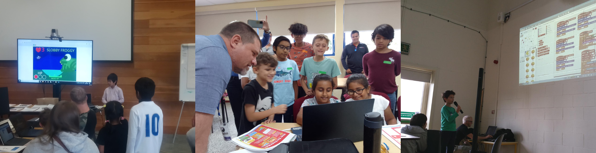

## Helping creators of different ages and abilities

--- collapse ---

---
title: Group creators together
---
If creators sit together based on experience or age, they will be more able to support each other. If creators work in pairs on a project, for example where you are sharing a device between two creators, you can use [pair programming](rpf.io/pair-programming). 

--- /collapse ---
  
--- collapse ---
  
---
title: Younger learners
---
As a general rule, younger children tend to have a shorter attention span.

If your club has younger creators, try breaking up the coding session into shorter activity slots, changing the activity, moving people around, or including a break.
--- /collapse ---

  
--- collapse ---
  
---
title: Focus on creator interests
---
You will create a more meaningful learning experience if you allow creators to work on something they are interested in.

--- /collapse ---
  

--- collapse ---
  
---
title: Reflecting on learnings
--- 
Encouraging learners to revisit the important learnings from the project. This solidifies new knowledge and provides opportunities for mastery. We provide opportunities for this in our [new project paths](https://projects.raspberrypi.org/en/paths).

--- task ---

Encourage reflection by asking questions of young people, such as:
+ What does this piece of code do?
+ How did you do that?
+ What would happen if you tried … instead? 
+ What would you do differently if you were starting the project again?

--- /task ---

--- /collapse ---

--- collapse ---
  
---
title: Celebrate creator success
---
It is important to celebrate creators’ achievements and contributions to the Code Club. Celebrating achievements with certificates, progress charts and even showcasing projects at the end of a session or as part of an event like Coolest Projects can help show creators that you recognise the effort they have made and can motivate them to continue on their digital making journey. We will go into more detail on this in the ["Celebrate and showcase" section](https://projects.raspberrypi.org/en/projects/club-mentoring/7).

--- /task ---

--- task ---

Encourage the group to listen and clap after a creator has shared a project. This helps ensure that the presenter has a positive experience.

--- /task ---

End of year project showcases or larger showcases like [Coolest Projects](https://online.coolestprojects.org/) can also be very rewarding for mentors, as you get to see how your support has helped creators progress and learn.

**Coolest Projects**  is a celebration of young digital creators and the amazing things they make with technology. There is an annual online showcase open to young people around the world, and in-person Coolest Projects events in several countries. All levels of coding projects are accepted from beginners to more advanced projects.

--- /collapse ---

## Culturally responsive mentoring

  
Coding can help young people to participate in and shape a rapidly changing world. It's important that learning materials present computing as a career that is open to all and avoid historic stereotypes related to computing. This includes how topics are presented, as well as the language and media assets chosen to introduce them. 
  
Our learning materials are designed to be inclusive. Care should be taken when using other materials.

--- task ---

The materials you use should present computing as an activity and career that is open to everyone.

--- /task ---

--- task ---
Consider the language and imagery you use when introducing topics.
--- /task ---

--- task ---
Be sure to avoid historical stereotypes related to computing.

--- /task ---

  
It’s important that creators can make projects that incorporate their knowledge, culture, and heritage.
  
Culturally relevant pedagogy promotes the development of creators’ critical consciousness of the world and encourages them to ask questions about ethics, power, privilege, and social justice. It emphasises opportunities to address issues that are important to creator's and their communities. 

  
### Culturally responsive mentoring practices include:
+ Drawing on young peoples’ cultural knowledge and experiences to inform their learning 
+ Providing opportunities for creator's to choose personally meaningful projects and to express their own cultural identities 
+ Exploring issues of social justice and bias
+ Using equitable guidance approaches, such as open-ended, inquiry-led activities and discussion-based collaborative tasks
+ Providing inclusive representations of a range of cultures, and making sure learning materials are accessible

  
--- task ---

**Review** the [guide about culturally responsive teaching](https://www.raspberrypi.org/blog/culturally-relevant-computing-curriculum-guidelines-for-teachers/){:target="_blank"}.

--- /task ---

## Accessibility practices for Code Clubs
Code Club welcomes creators and mentors of all ages, backgrounds, and abilities. At your club, there might be people with disabilities and accessibility requirements.

Everyone’s needs and abilities will be different, and this goes for all members of your Code Club — not just those with a disability.

  
To make your Code Club more accessible:

--- task --- 
  
**Listen to creators, parents, and guardians**: See how you can best support your creators. Make sure your contact information is up-to-date and you regularly check your email inbox.

--- /task ---

--- task --- 
  
**Make reasonable adjustments**: Talk about any adjustments you can make to support creators and how best to work with assistive technologies or aids.

--- /task ---

--- task --- 

**Use inclusive language**: Use language that is positive and free from discrimination and stereotyping. Avoid terms that might be offensive, or any language that excludes or isolates a person from other members of the club. It’s important for other members of your club to use inclusive language too. 

--- /task ---

It is good to reflect how someone chooses to describe themselves, so you may wish to ask them what they are most comfortable with.

Some adjustments you might make include:
+ Rearranging tables and chairs to create an accessible space.
+ Designating a quiet corner.
+ Providing a written or visual schedule of the session at the beginning.
+ Providing larger screens for anyone with visual impairments.
+ Printing instructions in a large, easy-to-read font.
+ Asking mentors to communicate slowly and clearly when they explain something.
+ Introducing the creator to a mentor who attends regularly, so they know an adult by name and have a friendly face to look out for.
+ Allowing movement breaks. Some people can find it challenging to sit for long periods, even if they find the activity engaging.

If there are a number of creators with disabilities, you could appoint a mentor as an accessibility officer to oversee these adjustments.

And remember, not all disabilities or additional needs are visible.

--- save ---
