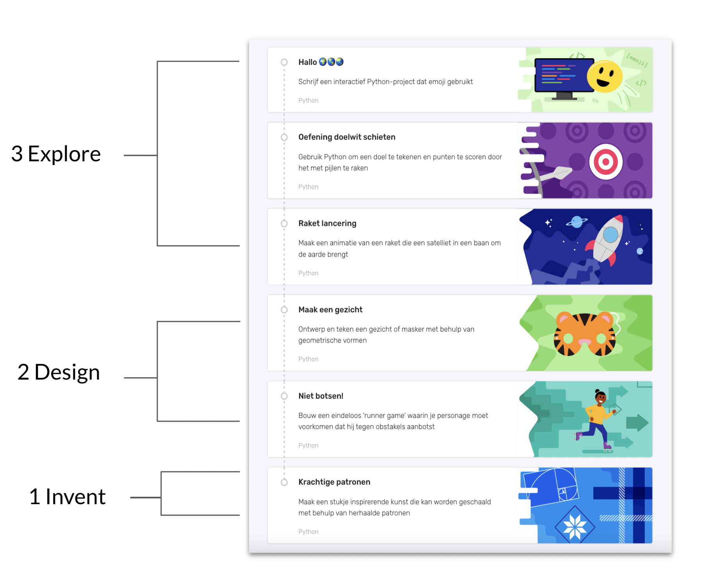
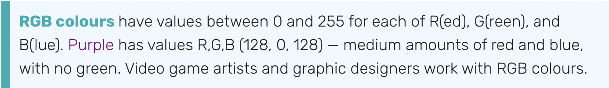
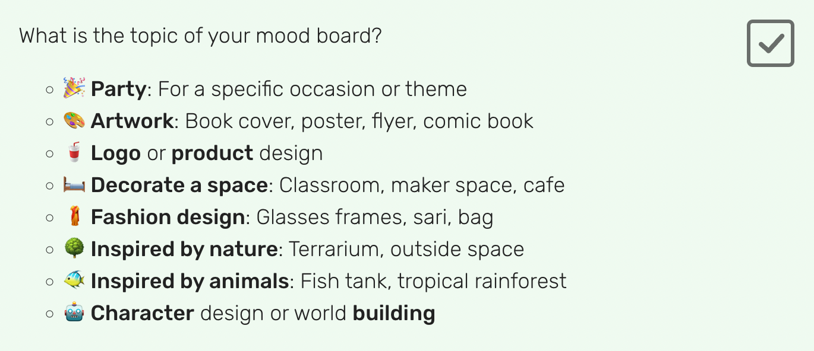
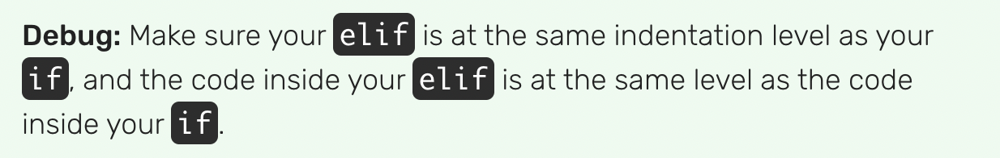
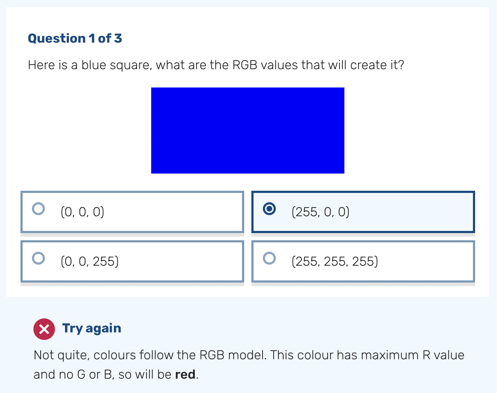
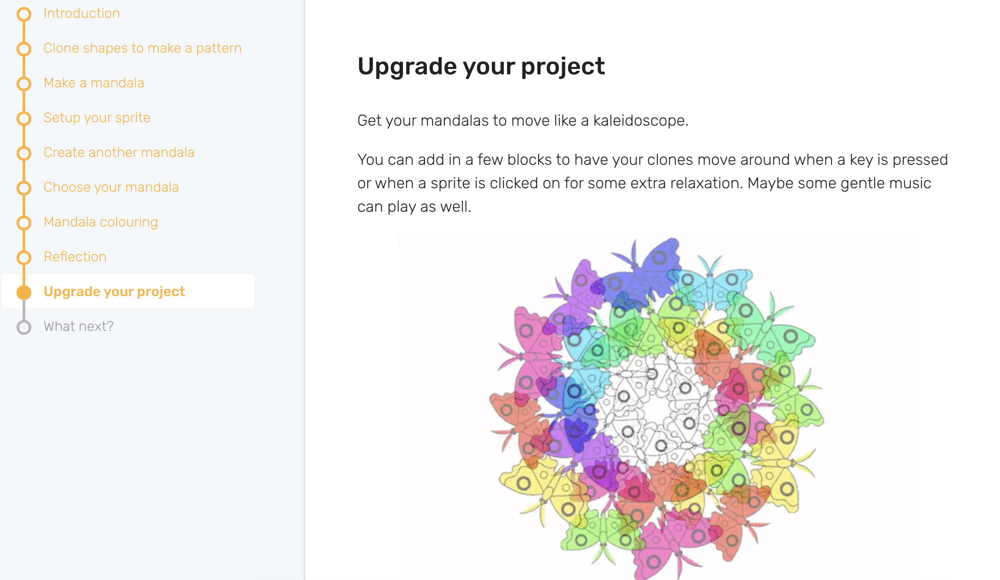

## Learning resources

Creators and mentors can use whatever resources, tools, and programming languages suit their needs. There are lots of freely available resources online. 

One way we support clubs is by providing icebreaker activities, unplugged resources, guided projects, and an online Code Editor tool to use in your Code Club. All of our resources and tools are **free**, and do not require young people to create a Raspberry Pi Foundation account to use.
  
## Icebreakers and unplugged activities
Icebreakers are a great way to introduce new creators to other club members, encourage communication, and create a sense of belonging. We recommend running an icebreaker activity at the start of a session when you have new creators join. 

Offline or unplugged activities take place away from a computer and model key concepts (e.g. selection, variables, algorithms) in different ways. These short games are fantastic ways to help creators feel relaxed, and can also help young people learn coding concepts and terminology in a fun, informal way.

--- task ---
Check out some example [icebreaker and unplugged activities](https://codeclub.org/en/resources/activities){:target="_blank"}.
  
--- /task ---
  

## Our project resources
On the [Code Club projects site](https://projects.raspberrypi.org/en){:target="_blank"}, we have a huge range of guided project paths and standalone projects for creators to try.

These projects are created by experienced educators and tested extensively so that we know they work. They are designed for creators to learn independently, and support them to use different technologies to bring their ideas to life through customising their projects.
  
--- task ---
Familiarise yourself with the projects creators are working on so you are better able to support them. 
--- /task ---

### Project paths

Some of our educational projects are in a [path format](https://projects.raspberrypi.org/en/paths){:target="_blank"} to better support creators who want to learn coding and gradually develop independence. 

--- collapse ---
---
title: Path structure
---

Each path is made up of six projects, of three different types, in a 3-2-1 structure:

+ The first **three Explore projects** introduce creators to a set of skills and knowledge, and provide step-by-step instructions to help creators develop initial confidence. 
+ The next **two Design projects** are opportunities for creators to practise the skills they learnt in the previous Explore projects, and to express themselves creatively. 
+ In the final **one Invent project**, creators focus on completing a project to meet a project brief for a particular audience. The project brief is written so that they can meet it using the skills they’ve learnt by following the path up to this point. 
  

--- /collapse ---

### Project path features

We’ve also introduced some new features to add interactivity, choice, and authenticity to each project in a path.

--- collapse ---
---
title: Real-world info box-outs
---

These provide interesting and relevant facts about the skills and knowledge being taught.
  

--- /collapse ---

--- collapse ---
---
title: Design decision points
---
These allow creators to make choices about how their project looks and what it does, based on their preferences and interests.
  

--- /collapse ---

--- collapse ---
---

title: Debugging tips

---
Throughout each project, debugging tips give creators guidance for finding and fixing common coding mistakes.

--- /collapse ---
  
--- collapse ---
---
title: Project reflection steps
---
These solidify new knowledge and provide opportunities for mastery by letting creators revisit the important learnings from the project. Common misconceptions are highlighted, and they are guided to the correct answer.

--- /collapse ---

--- collapse ---
---
title: An open-ended upgrade step
---
The end of each project offers inspiration for young people, by giving them ideas for ways in which they could continue to improve upon their project in the future.

--- /collapse ---
 

You can learn more about our paths and their features with [our facilitator guide](https://projects.raspberrypi.org/en/projects/321-make-facilitator-guide){:target="_blank"}.

## Our Code Editor
We have created a [free online text-based Code Editor](https://editor.raspberrypi.org/en/){:target="_blank"} to help young people aged 7 and over learn to write code. 

--- collapse ---
---
title: Code Editor features
---
+ It lets you run Python or HTML/CSS code straight in your browser, with no setup required
+ It makes getting started with text-based coding easier thanks to its simple and intuitive interface
+ Your code is automatically saved when you're signed in to your Raspberry Pi Foundation account
+ If you’re not signed in, your code changes persist for the session, so you can refresh or close the tab without losing your work
+ You can download your code to your computer
+ You can switch between dark and light modes
+ You can enlarge or reduce the text size in input and output, which is especially useful for people with visual impairments and for educators and volunteers who want to demonstrate something to a group of learners
--- /collapse ---

