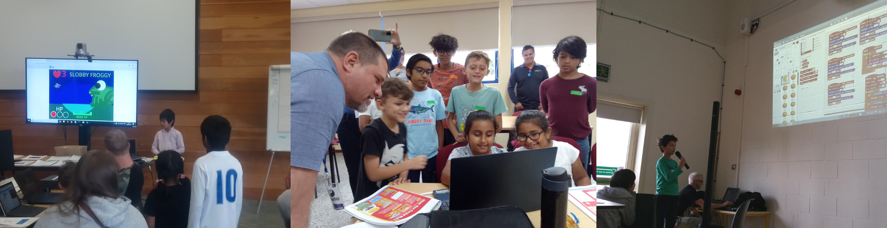

## Celebrating successes
It is important to celebrate creators’ achievements and contributions to the Code Club. For example, recognise the progress they make with a project or the support they offer another
creator. 

Try to focus on the effort and work rather than the outcome.

  
As well as mentors providing feedback directly to individual creators, you can use our resources to create moments where the whole Code Club recognises and celebrates each other’s successes. 

--- collapse ---

---
title: Presenting certificates
---
You can use our [editabe and printable **certificates**](https://codeclub.org/en/resources/certificates) to celebrate creators achievements. These can be used to celebrate a young person completing a project, a path of six projects or developing skills like problem-solving or understanding a specific coding concept. 

--- /collapse ---
  
--- collapse ---
  
---
title: Using progress charts
---
[Our **progress charts**](https://codeclub.org/en/resources/progress-charts) are available for four project paths:
- Introduction to Scratch
- Introduction to web
- Introduction to Python
- Introduction to micro:bit

The progress charts have been designed as colouring sheets which you can print to use in your Code Club. When coders complete a project or achievement, they can colour in the badges on their progress chart to celebrate what they have done!

--- /collapse ---

### Showcasing learning

A “show and tell”, where young people share what they are working on at the end of a session, is a great way to develop their presentation and public speaking skills. 

There are a variety of ways to do this. Projects can be presented on a screen, young people can gather around a creator's laptop or a projecter can be used.

--- task ---

Asking creators to showcase their projects shows that you recognise the effort they have made and that you believe that they have something of value to share with others. 

--- /task ---

--- task ---

Encourage the creators to listen and clap after another creator has shared a project. This helps ensure that the presenter has a positive experience.

--- /task ---

End of year project showcases or larger showcases like [Coolest Projects](https://online.coolestprojects.org/) can also be very rewarding for mentors, as you get to see how your support has helped creators progress and learn.

**Coolest Projects** is a creative technology showcase for young people, it includes both in-person events and an online project gallery. Coolest Projects Global is free and open to creators up to the age of 18, wherever they are in the world.

## Reflecting on learnings
Encouraging learners to revisit the important learnings from the project solidifies new knowledge and provides opportunities for mastery. We provide opportunities for this in our [project paths](https://projects.raspberrypi.org/en/paths).

--- task ---

Encourage reflection by asking questions of young people, such as:
+ What does this piece of code do?
+ How did you do that?
+ What would happen if you tried … instead? 
+ What would you do differently if you were starting the project again?

--- /task ---
